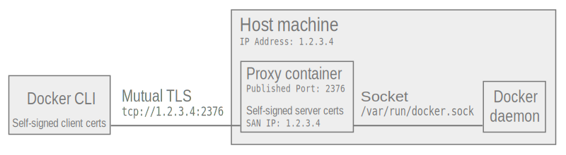

# Container image for Mutual TLS access to Docker Daemon
A secure, easier-to-use alternative to enabling Docker daemon's [built-in mutual TLS settings](https://docs.docker.com/engine/security/https) that works on default daemon installations.

Mutual TLS connections from docker clients are securely terminated at a container with a process that proxies to a docker daemon via a bind-mounted docker socket. 



## Requirements
* Docker daemon with default settings (Linux or Windows)
  * Note: daemon does not need to be listing on network port, only needs default socket listener
* Hostname or IP for your docker daemon host machine

## Usage

### Build the image locally on a Docker daemon
#### Linux/MacOS
Note: no certs are included in the image. It generates self-signed certs on container start.

```bash
docker build --tag docker-mtls-socket-proxy -f Dockerfile.linux .
```
  
#### Windows
```powershell
docker build --tag docker-mtls-socket-proxy -f Dockerfile.windows --build-arg os_tag=1809 .
```

### Start your container
This will start the process and generate self-signed certificates (or re-use previously generated ones). 

#### Linux/MacOS
```bash
hostname=<"my-docker-host" or "10.1.2.3">

docker run --detach \
    --name tlsproxy \
    --publish 2376:2376 \
    --volume tlsproxy-certs:/certs \
    --volume /var/run/docker.sock:/var/run/docker.sock \
    --restart=always \
    --memory 256m \
    docker-mtls-socket-proxy \
        -hostname $hostname
```

# Windows
```powershell
$hostname=<"my-docker-host" or "10.1.2.3">

docker run --detach `
    --name tlsproxy `
    --publish 2376:2376 `
    --volume tlsproxy-certs:c:/certs `
    --volume \\.\pipe\docker_engine:\\.\pipe\docker_engine `
    --restart=always `
    --memory 256m `
    docker-mtls-socket-proxy `
        -hostname $hostname
```

Note: if you generate incorrect certs, you must remove the volume or they will not regenerate:
```
docker volume rm tlsproxy-certs
```

### Copy client credentials to your client

To copy client certs from your container to your client machine, there's a helpful Bash script that is output in the logs. 

When run, it will write certs to `~/.docker/$hostname/` along with a helper `env.sh` script you can `source`. 
 
1. On Docker host, print the logs from the container
    ```
    docker logs tlsproxy
    ```

2. On Docker host, copy/paste all output between `COPY BELOW` and `COPY BELOW`
    
    ```
    ##### COPY BELOW #####
    <highlight and copy these lines between, usually ~100>
    ##### COPY ABOVE #####
    ```

3. On client, Follow `INSTRUCTIONS` from logs to check and execute clipboard contents

    ```bash
    # MacOS 
    pbpaste | shasum  # Should match "Expected SHA1:" from logs
    pbpaste | bash
    
    # Linux
    xclip -o -selection clipboard | shasum
    xclip -o -selection clipboard | bash
    ```

    * Note: You can also copy paste data just each certs/key from the logs if preferred
        * `~/.docker/$hostname/cert.pem`
        * `~/.docker/$hostname/key.pem`
        * `~/.docker/$hostname/ca.pem`

4. On client, source your `env.sh` to set your `DOCKER_HOST` `DOCKER_TLS_VERIFY` and `DOCKER_CERT_PATH`.

    ```bash
    source ~/.docker/$hostname/env.sh
    ```
   
## Avoid your tlsproxy container
If you stop the `tlsproxy` container, you'll lose connectivity to your daemon and have to connect over SSH to restart it (`docker start tlsproxy`).

To avoid `docker` CLI operations effecting your `tlsproxy` container, use filters like:

* List all containers besides `tlsproxy`
```
docker ps -f since=tlsproxy
```

* Remove all containers besides `tlsproxy`
```
docker rm -f $(docker ps -q -f since=tlsproxy)
```
